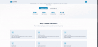

# LMS Platform Frontend

This is the frontend for the LMS Platform. It provides a user-friendly interface for managing courses, users, and learning materials.

## Features

- Course management
- User authentication
- Interactive dashboards
- Responsive design

## How It Works



## Getting Started

1. Clone the repository:
    ```bash
    git clone https://github.com/your-username/LMS-Platform.git
    ```
2. Install dependencies:
    ```bash
    cd LMS-Platform/Frontend
    npm install
    ```
3. Start the development server:
    ```bash
    npm start
    ```


## License

This project is licensed under the MIT License.