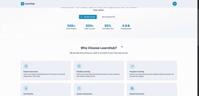

# LMS Platform

## Overview

LMS Platform is a comprehensive Learning Management System designed to streamline online education. It enables administrators to manage courses, instructors to deliver content, and students to engage with interactive learning materials.

## Features

- Course creation and management
- User authentication and roles (admin, instructor, student)
- Assignment submissions and grading
- Progress tracking and analytics
- Discussion forums and messaging

## Technology Stack

- **Frontend:** React.js, Tailwind CSS
- **Backend:** Node.js, Express.js
- **Database:** MongoDB
- **Authentication:** JWT
- **Deployment:** Docker, AWS

## Preview

.
